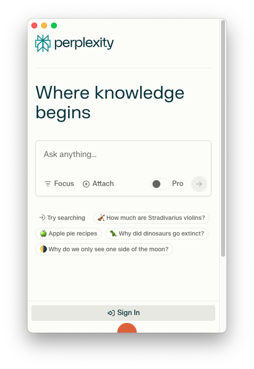
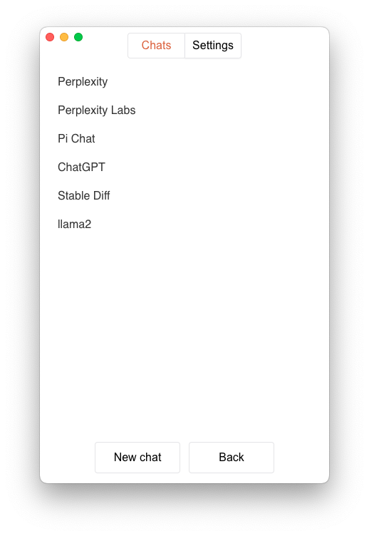

# gzi

A simple app with the ability to add any websites and use them in the desktop app (intended to add online AI chats)
supa             |  dupa
:-------------------------:|:-------------------------:
  |  

## Steps

### Install
```bash
$ yarn
```

### Development
```bash
$ yarn dev
```

### Build
```bash
# For windows
$ yarn build:win

# For macOS
$ yarn build:mac

# For Linux
$ yarn build:linux
```

